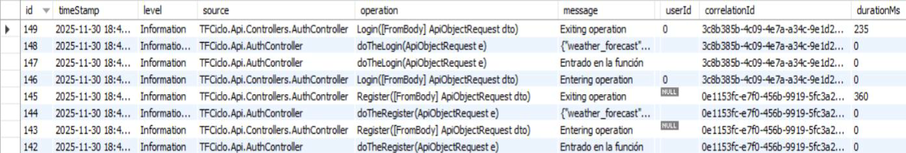
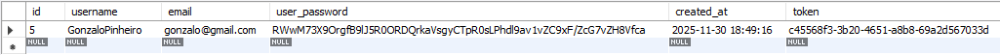

# TFCiclo – Middleware ASP.NET para autenticación y APIs externas

TFCiclo es un middleware desarrollado en ASP.NET Standard 8.0 que centraliza la autenticación de usuarios y la comunicación con APIs externas, utilizando una arquitectura modular preparada para crecer en futuras versiones. Su objetivo es servir como base sólida para proyectos posteriores, aplicando buenas prácticas, programación asíncrona y separación clara de responsabilidades.​

---

## 📖 Contexto del proyecto

Este proyecto se ha desarrollado como **Trabajo de Fin de Ciclo (DAM)** en el centro Montecastelo. Nace a partir de la experiencia en prácticas sobre un middleware ya existente, con la intención de **crear una solución propia desde cero** que consolide los conocimientos adquiridos.

La **versión 1** prioriza el aprendizaje y el diseño de una buena base técnica más que el producto final, dejando el terreno preparado para futuras iteraciones.

---

## 🏗️ Esquema de la arquitectura

A nivel conceptual, el flujo principal del sistema puede verse así:

```text
Cliente (App / Postman)
          |
        HTTPS
          |
     [ TFCiclo.API ]
(Controladores + lógica)
        /      \
       /        \
[TFCiclo.Data]  [TimerModule]
 (BD + JWT)         |
        |           |
      MySQL   [TFCiclo.Connector]
                  |
             APIs externas
              (OpenWeather)
```

- **TFCiclo.API** es la única parte expuesta al exterior y gestiona los **endpoints de login, registro y consulta de clima**.
- **TFCiclo.Data** centraliza el acceso a **MySQL**, la generación de **JWT**, el hash de contraseñas y el sistema de logs.
- **TimerModule** ejecuta un **servicio en segundo plano** que periódicamente consulta ubicaciones en base de datos y pide datos a las APIs externas a través de **TFCiclo.Connector**.

---

## 🔧 Arquitectura general

La solución se organiza en varios proyectos ASP.NET y bibliotecas de clases, cada uno con una responsabilidad bien delimitada:

- **TFCiclo.API**  
  Web API que expone los endpoints, gestiona los controladores y concentra la lógica principal, incluyendo **login y registro mediante JWT**.

- **TFCiclo.Data**  
  Capa de acceso a datos, responsable de todas las operaciones con **MySQL** mediante **Dapper**, modelos, repositorios y utilidades de seguridad (hash de contraseñas, generación y validación de JWT, logger, etc.).

- **TFCiclo.Connector**  
  Módulo encargado de realizar las peticiones HTTP a **APIs externas** como OpenWeather y procesar sus respuestas.

- **TimerModule**  
  Servicio en segundo plano con un **timer perpetuo** que actúa como trigger, lanzando periódicamente las peticiones a las APIs externas y actualizando la información en base de datos.

---

## ⚙️ Tecnologías utilizadas

- **Lenguaje y framework:** **C#** con **ASP.NET Core / .NET Standard 8.0**.  
- **Base de datos:** **MySQL**, accedida mediante **Dapper** como micro ORM.  
- **Autenticación y seguridad:** **JWT** para login/register, hash de contraseñas y sistema de logging.  
- **Servicios externos:** API de **OpenWeather** para obtener previsiones meteorológicas por ubicación.  
- **Herramientas de apoyo:** **Visual Studio** para desarrollo/localhost y **Postman** para probar endpoints.  

---

## 📁 Estructura del repositorio

```text
/
├─ TFCiclo.API
│  ├─ Controllers
│  │   ├─ AuthController.cs
│  │   └─ WeatherController.cs
│  ├─ appsettings.json
│  └─ Program.cs / Startup
│
├─ TFCiclo.Data
│  ├─ ApiObjects
│  ├─ Models
│  ├─ Repositories
│  ├─ Security
│  ├─ Services   (Logger, etc.)
│  └─ SQLSentences (CREATE TABLE, etc.)
│
├─ TFCiclo.Connector
│  ├─ GetWeatherFromApi.cs
│  └─ TimerConnector.cs
│
└─ TimerModule
   └─ TimedHostedService.cs
```


Esta estructura refuerza la **modularidad**: cada proyecto tiene una responsabilidad clara, lo que facilita el mantenimiento, las pruebas y la extensión futura del sistema.

---

## 📸 Capturas de ejemplo

- **Pruebas con Postman**  
  - Petición **POST** al endpoint de **registro** con el JSON del nuevo usuario y respuesta exitosa con `result = true` y datos del usuario/token.  
  

  - Petición **POST** de **login**, mostrando el **token JWT** devuelto y su uso en llamadas posteriores al endpoint protegido de previsión meteorológica.
    

- **Logs y base de datos**  
  - Captura de la **tabla de logs** en MySQL, mostrando entradas con `correlationId`, tipo de operación, fecha y resultado.  
  
  - Captura de la tabla de **usuarios**, donde se ve la información guardada tras las operaciones del middleware.
  

---

## 🚀 Puesta en marcha en local

Pasos básicos para levantar el proyecto en local:

1. **Configurar la base de datos MySQL**  
   - Crear la base de datos utilizando las sentencias `CREATE TABLE` incluidas en el proyecto **TFCiclo.Data** (fichero de sentencias SQL).

2. **Configurar la API**  
   - Ajustar `appsettings.json` con:  
     - El **intervalo del timer** que usará el `TimerModule`.  
     
   - Crear las variables de entorno:
     - ApiKeys__OpenWeather -> La api key de OpenWeatherMap
     - ConnectionStrings__DefaultEncrypted -> La cadena de conexión a DB

3. **Ejecutar la API**  
   - Lanzar **TFCiclo.API** desde Visual Studio en modo **HTTPS**, usando el puerto configurado en `launchSettings.json` (por ejemplo, 7008).

4. **Probar endpoints**  
   - Usar **Postman** para probar:  
     - `POST /api/Auth/Register`  
     - `POST /api/Auth/Login`  
     - `POST /api/GetWeatherForecast` (con JWT en el header -> Authorization + body -> Bearer "token")  
   - Verificar la persistencia en base de datos y la creación de logs.

---

## 🔒 Seguridad, autenticación y logging

El sistema de autenticación se basa en un flujo de **login/register con JWT**:

- En el **registro**, se valida que el usuario no exista, se **hashea la contraseña** y se inserta en base de datos junto con sus datos básicos.  
- En el **login**, se verifica la contraseña, se genera un **token JWT firmado** y se devuelve al cliente para su uso en endpoints protegidos.  

Además, se aplican buenas prácticas como:

- **Inyección de dependencias** para repositorios, loggers y configuración.  
- **Cifrado de la cadena de conexión** a base de datos.  
- **Sistema de logging** centralizado en base de datos, incluyendo una **pila de logs** para evitar bloquear el hilo principal mientras se registran las operaciones.  

---

## 📈 Estado actual y futuras versiones

En la **versión 1**, el proyecto ofrece:

- Sistema de **registro e inicio de sesión** con JWT.  
- Acceso a **MySQL** mediante Dapper.  
- Consumo de la API de **OpenWeather** para obtener previsiones meteorológicas por ubicación.  
- **Timer** que actualiza de forma periódica las previsiones almacenadas.  
- **Sistema de logs** que registra la actividad en base de datos.  

Para la **versión 2**, el foco estará en seguridad avanzada y robustez del middleware:

- Integración con **OAuth de Google** para autenticación externa.  
- **Rotación periódica de claves JWT**.  
- Implementación de **refresh tokens** para gestionar sesiones más largas de forma segura.  
- **Rate limiting** para proteger la API frente a abusos o exceso de peticiones.  
- Ejecución de **pruebas de estrés** para analizar el comportamiento del sistema bajo alta carga.  

La **versión 3** se centrará en el despliegue:

- Ejecución del proyecto en una **Raspberry Pi** como servidor siempre encendido.  
- O migración / despliegue en **Azure** (por ejemplo, Azure App Service) para explorar opciones de despliegue en la nube.  

A futuro queda abierta la posibilidad de desarrollar una **app cliente multiplataforma** que consuma este middleware como backend.